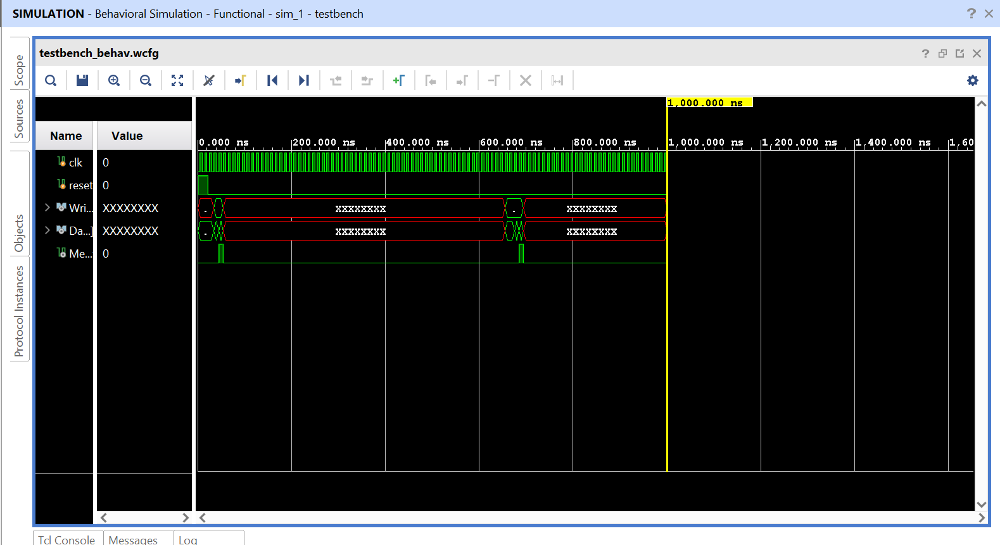

# 32-bit Single-Cycle RISC-V Processor

## Overview
This project is a Register-Transfer Level (RTL) implementation of a **32-bit Single-Cycle RISC-V Processor** (RV32I Instruction Set), designed in Verilog HDL and verified using Xilinx Vivado. The core architecture includes a complete Datapath and Control Unit capable of executing Arithmetic, Logical, Memory, and Branching instructions.

## Key Features
- **Architecture:** RV32I (32-bit Integer) Single-Cycle.
- **Components:** Custom ALU, 32x32 Register File, Program Counter, Immediate Generator, and Control Decoders.
- **Verification:** Self-checking Testbench validated with assembly programs.
- **Tools Used:** Xilinx Vivado 2024.2, Verilog HDL.

## Supported Instructions
The processor currently supports a subset of the RV32I ISA:
- **R-Type:** ADD, SUB, AND, OR, SLT
- **I-Type:** ADDI, LW (Load Word)
- **S-Type:** SW (Store Word)
- **B-Type:** BEQ (Branch if Equal)

## Simulation Results
The design was verified in Vivado. The waveform below demonstrates the execution of a test program that performs data processing and memory operations.
*(Note: Green blocks indicate valid data propagation through the Datapath).*

## File Structure
- `riscv.v` - Top-level module integrating Control Unit and Datapath.
- `controller.v` - Main Decoder and ALU Decoder logic.
- `datapath.v` - Interconnections between ALU, Registers, and Memory.
- `alu.v` - Arithmetic Logic Unit (Add, Sub, And, Or, Slt).
- `regfile.v` - 32x32 Register File (Dual Read, Single Write).
- `imem.v` / `dmem.v` - Instruction and Data Memories.
- `testbench.v` - Simulation environment.

## Future Scope
- Implementation of Pipelining (5-stage) to improve throughput.
- Adding Hazard Detection and Forwarding Units.
- Synthesis and implementation on Artix-7 FPGA.
